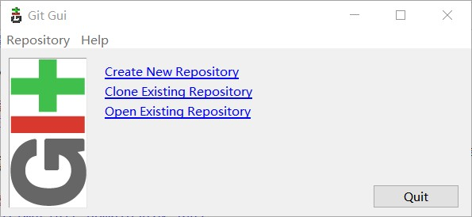
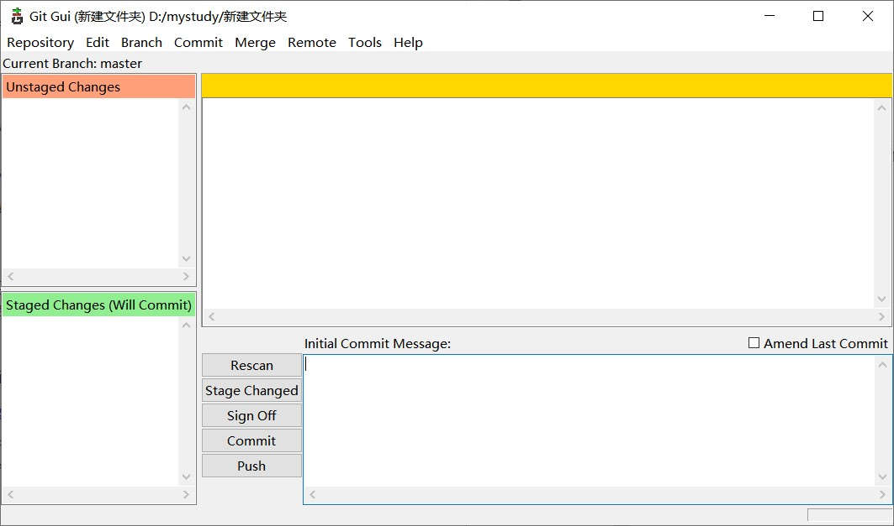
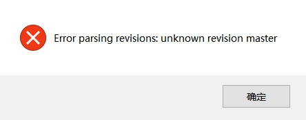
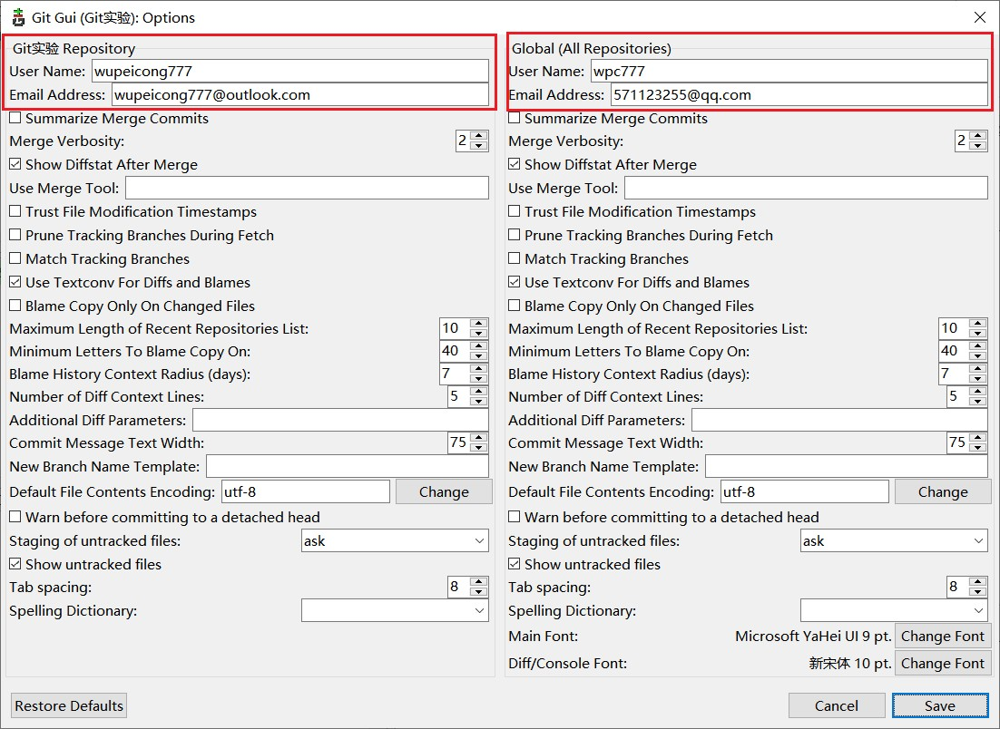
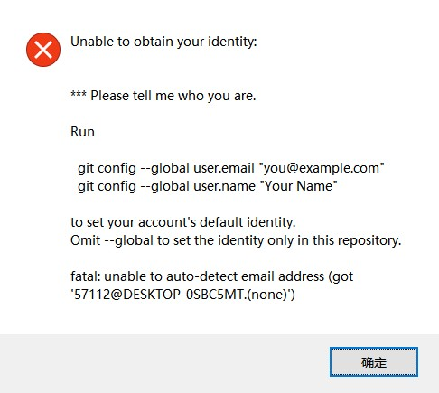
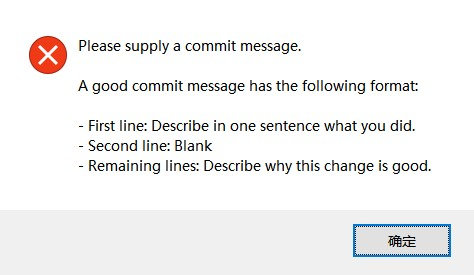
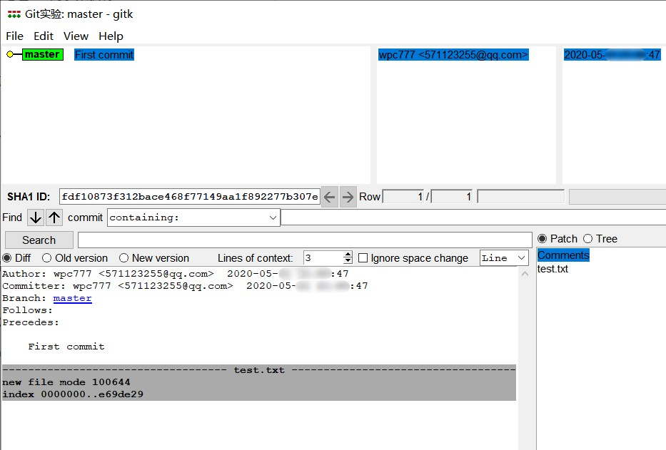
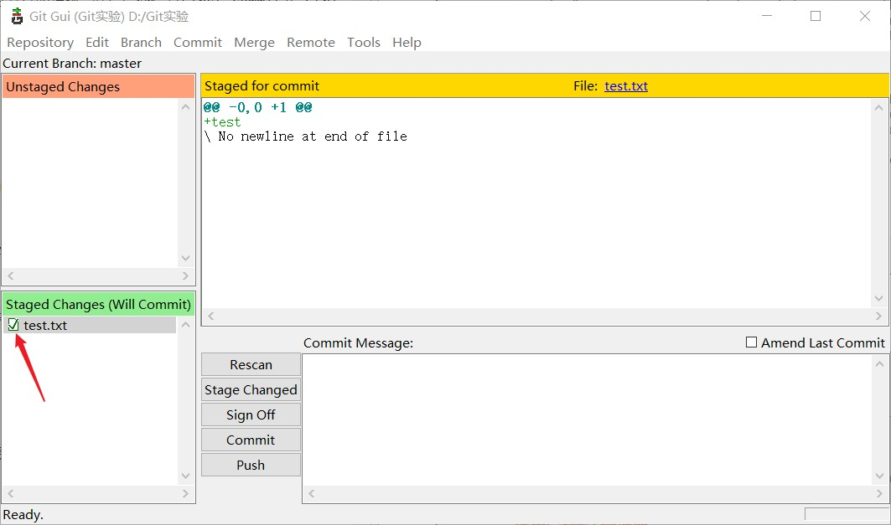
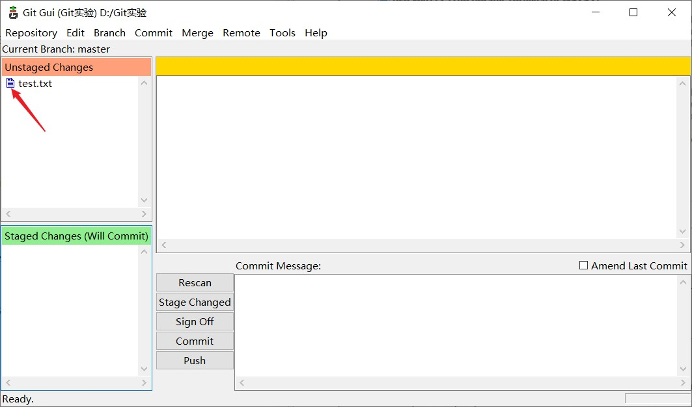

# Git实验

## 实验目的
1. 学习 Git 软件的安装
2. 学习 Git 的简单使用，增加文件，提交，创建分支，增加远程，下拉、上推，合并
3. 学习 Git 的冲突处理 

## 实验平台
- Window 10

## 实验前准备
1. 到Git官网下载[64-bit for Windows](https://github.com/git-for-windows/git/releases/download/v2.26.2.windows.1/Git-2.26.2-64-bit.exe)版本的Git版本控制工具。
2. 翻阅相关资料，掌握分布式版本控制系统 Git 的基础知识。
3. 查找 Git 的使用教程，熟悉 Git 命令以及 Git GUI 的使用。

## 实验内容

### Git的安装

#### 阅读软件许可
  

阅读软件许可并点击 next 进行下一步安装。

#### 选择安装的组件

根据喜好选择：
* 是否添加桌面快捷键图标
* 是否在右键菜单中添加"Git Bash Here"和"Git GUI Here"快速启动
* 将.git*配置文件与默认文本编辑器关联
* 将Bash运行的.sh文件关联

#### 是否创建开始菜单

#### 选择默认编辑方式

这里选择Vim作为默认编辑器。

#### 设置路径环境变量

勾选第二项，将为git命令配置全局环境变量，可以在Windows的cmd模式和Git自带命令行模式使用。

#### 选择HTTP远程连接方式

使用OpenSSL库，而不使用Windows安全通道库，不会产生兼容性问题。

#### 配置换行格式

#### 使用Git默认终端

选择默认的MinTTY终端。

#### 配置额外选项

* 启用缓存，在Git命令行模式可以通过键盘上下键切换出先前使用git命令，提高效率。
* 使用Git为Windows提供的默认管理器。

#### 等待安装

等待安装完后，可以在选择立即运行Git Bash和查看当前发行版的版本说明。

### Git的本地使用

在Git使用前可以建立这样的概念：git commit命令通知Git帮你保存一份当前项目的快照，Git将为项目中的每一个文件的当前状态保存当前的“记录”，相当于保存了当前项目的版本。Git命令中绝大部分的操作都会围绕这份“记录”展开。但首先，我们需要有一个Git仓库。

#### 创建本地仓库

在项目目录中右键Git GUI，可以看到当前的Git GUI界面为：

Create New Registory并选择当前项目的文件夹，将当前目录构建为一个Git仓库，界面扩展为：

项目目录下将会出现一个后缀为.git的隐藏文件，代表你已经成功。

以上操作在Git Bash命令行模式下对应命令为
<code>git init</code>

#### 提交

当你处于GUI界面，不用急着提交你的初版，点开Repository-Visualize master's History查看master分支的历史会出现如下错误：

这是因为当前的主分支master下没有任何提交过。接下需要先点开Edit-Options确认你是否填写了你个人的User Name和Email Address，左侧为本地设置，右侧为全局设置。

除非你填写了本地或者全局的User Name和Email Address，不然当你增加需要跟踪的文件时会出现如下错误：

以上操作在Git Bash命令行模式下对应命令为  

<code>git config --global user.name ['yourname']</code>

<code>git config --global user.email [youremail]</code>

当往目录下添加了一个test.txt的文件，在GUI实用快捷键F5刷新界面，左上框显示Unstaged Changes，这是因为目录新增了文件而还没跟踪。
快捷键 Ctrl+I 添加对左上框所有文件的跟踪，快捷键 Ctrl+Enter 提交，发现如下错误：

这是因为我们没有填写右下框的本次提交信息，而填写的提交信息将作为本次提交对应历史节点的描述。填写提交信息First commit并 Ctrl+Enter 提交，再次查看master分支的历史，成功提交。

以上操作在Git Bash命令行模式下对应命令为  

<code>git add .</code>

<code>git commit -m 'First commit'</code>

使用-a参数也可以实现在提交前将修改内容全部添加到缓冲区，即<code>git commit -am '[committitle]'</code>命令。

#### 取消缓存

如果使用Git Bash命令行模式，错误操作而对某个已跟踪的文件执行了git add命令即缓存了该文件，并且还未提交，使用
<code>git reset HEAD --[yourfile]</code>
命令将回退当前对该文件的缓存。

对应的Git GUI模式操作应该是在左下框找到不想缓存的该文件，点击其文件名前面的图标将其移回左上框。

#### 从缓存区移除文件

相较于git reset HEAD命令将缓存区恢复为未修改前的样子，
<code>git rm [yourfile]</code>
命令将把文件从缓存区和工作目录中剔除，这意味着我在项目目录下也不再能找到它。

如果只是想将文件移除缓存区不再跟踪，但希望它依然在项目目录下能找到时，可以使用更加缓和的
<code>git rm --cached [yourfile]</code>
命令。

#### 创建分支与切换分支

使用分支意味着我们能在不影响开发主线在分支上进行我们的开发工作，使开发主线处于一个稳定版本。由于Git的分支实质上仅是包含所指对象校验和（长度为40的SHA-1值字符串）的文件，所以它的创建和销毁都异常高效。创建一个新分支就相当于往一个文件中写入41个字节（40个字符和1个换行符）。

使用
<code>git branch [branchname]</code>
命令创建新分支，虽然已经创建了新分支，但我们仍处于原先的分支上，仍需进行下一步切换才能在新分支上开展我们的工作。

每次切换分支前需要将当前分支修改的内容全部提交，否则报错。使用
<code>git checkout [branchname]</code>
切换到对应新分支，当有需要的时候使用该命令再切换为master分支。

我们在新分支testBranch添加了新文件testbranch.txt并提交，再切换到其他分支时项目目录下的testbranch.txt便"消失"了，当我们切换回testBranch分支它又"神奇"出现了，这也正是分支的特性。

有一种更快捷的创建并切换到新分支方法，使用参数-b执行
<code>git checkout -b [branchname]</code>命令，将创建新分支并立即切换到该分支上，相当于上述分支创建命令和切换命令的融合。

#### 分支重命名

<code>git branch -m [oldname] [newname]</code>

#### 合并分支

一旦某分支有了可以合并到当前分支的独立内容，可以使用
<code>git merge [branchname]</code>
命令将任何分支合并到当前分支中。需要注意的是，不但新增和修改的内容会被合并，删除操作也会被合并。

合并时Git不会将一个文件作修改文件名后的前后样子视为两个不同的文件，可以理解它记住的是增量，也就是它记住了那个文件的文件名修改。但即使是这样，也还是存在合并冲突的情况。

如果想要合并的分支所指向的提交是所在的提交的直接后继，Git以一种名为“快进式合并”的方式进行合并，会直接推进式地移动分支指针，因为没有需要解决的分歧。如果开发历史从一个更早的地方分叉开来，合并分支不是当前所在分支的直接后继，但它们有一个公共祖先，Git会取两个分支的末端所指快照与该公共祖先进行三方合并，与前面推进式移动指针不同，三方合并将生成一个新快照并且自动创建一个新的提交指向它。

合并两个不同分支时，可能会遇到各自分支的同级目录下有相同命名相同格式的文件，产生这种冲突时Git做了聪明的处理。Git会在有冲突的文件中加入标准的冲突解决标记，这样你可以打开这些包含冲突的文件然后手动解决冲突：
<pre><<<<<<< HEAD</pre> 
此处将显示当前分支的冲突内容
<pre>=======</pre>
此处将显示合并分支的冲突内容
<pre>>>>>>>> [mergebranchname]</pre>

此时Git做了合并，但是没有自动地创建一个新的合并提交。Git会暂停下来，等待你去解决合并产生的冲突。 你可以在合并冲突后的任意时刻使用git status命令来查看那些因包含合并冲突而处于未合并（unmerged）状态的文件。

可以使用相关的Git的图形化合并工具如kdiff3、emerge、p4merge，默认为opendiff。如果不使用Git的图形化合并工具，那么直接修改包含冲突的文件从冲突内容中择一保留，将标准冲突解决标记和不要的冲突部分删掉即可，解决完冲突之后重新将文件用git add命令暂存才能git commit完成合并提交。

#### 删除分支

当我们在分支开发完成并将内容合并到master分支上，该分支可能不再被需要了，可以使用
<code>git branch -d [branchname]</code>
命令将该不要的分支删除。

#### 为特殊提交加标签

如果希望记住某个特别的提交快照，以便在查看提交历史时可以分辨出来，可以使用
<code>git tag -a [tagmessage]</code>
命令给最新一次提交打上标签。

如果我们想对过去的提交追加标签，使用
<code>git tag -a [tagmessage] [SHA key]</code>
命令对SHA key所指定的提交打上标签。某次提交的SHA key通过
<code>git log --oneline --decorate --graph</code>
命令查看该提交前的无序串，打上标签后同样通过该命令可以查看到带标签的提交历史拓扑图。

#### 变基

变基将并行的提交历史“重塑”成线性历史，能产生一个更简洁的提交历史。

<code>git rebase --onto [basebranch] [branchA] [branchB]</code>将分支A、B的公共祖先之后到分支B提交末端的提交历史在base分支“重放”一遍，base快进式合并向前移动指针进行更新。

<code>git rebase --onto [basebranch] [branchA]</code>将分支base、A的公共祖先之后到分支A提交末端的提交历史在新的base分支“重放”一遍，base快进式合并向前移动指针进行更新。

最终从三叉戟型的base、A、B提交历史，可以理解为生成一条base+(B-A)+(A-base)的新提交历史，快进式合并为新base分支。很多时候二叉型历史只需A到base的变基。经过如上变基操作，分支A、B已经“合并”到了base分支上，被可以删除了。

并不提倡变基。变基操作的实质是丢弃了一些现有的提交，去相应地新建内容一样但实际上有异的提交，需要遵循一条准则：不要对在你的仓库外有副本的分支执行变基。否则将导致基于该分支工作的团队合作者需要重新合并他们的工作，繁琐且无益。

### Git的远程使用

#### 克隆已存在的仓库

如果想复制已存在的Git仓库，以仓库的地址url为参数执行
<code>git clone [url]</code>
命令，等待片刻将成功克隆。

#### Git托管服务器

如GitHub、Gitee、GitLab。

#### 远端仓库的添加与删除

使用
<code>git remote add [alias] [url]</code>
命令将服务器上地址为[url]的仓库，以[alias]为本地别名添加为本地的远端仓库。如果命令不加[alias]部分，别名将默认为origin，可以通过
<code>git remote</code>
查看本地所设置的远端仓库。

<code>git remote rm [alias]</code>命令用于删除本地曾添加的别名[alias]的远端仓库。

#### 从远端仓库获取远程分支

当远端仓库已经配置好了，使用
<code>git fetch [alias] [branch]</code>
命令让Git去获取特定远端仓库（不加[branch]）或特定远程分支在服务器更新了而本地没有的数据，远程跟踪分支是远程分支状态的引用，是我们无法移动的本地引用，以[alias]/[branch]的形式命名。

当克隆一个仓库时，它通常会自动地创建一个跟踪origin/master的master分支。如果愿意，同样也可以设置其他的跟踪分支，或是一个在其他远程仓库上的跟踪分支。 可以通过
<code>git checkout -b [localbranch] [alias]/[branch]</code>
创建并切换到[alias]/[branch]的本地跟踪分支[localbranch]，Git也提供了另一种快捷方式--track:
<code>git checkout --track [alias]/[branch]</code>
，而如果远程分支[alias]/[branch]在本地没有一个名为[branch]的分支，执行
<code>git checkout [branch]</code>
将自动创建该远程分支的跟踪分支。

虽然我们会得到远端仓库的分支，但Git并不支持我们直接切换到这些分支上，只可以通过执行
<code>git merge [alias]/[branch]</code>
将服务器的更新合并到当前所在的本地分支。

对于以上的fetch和merge命令所做的检取和合并，有更简单的命令
<code>git pull [alias] [branch]:[localbranch]</code>
，它将自动检取更新并完成合并远端仓库（不加[branch]）或指定分支。

#### 向远端仓库推送本地分支

执行<code>git push [alias] [localbranch]:[branch]</code>将特定的本地分支[localbranch]推送到远端仓库[alias]/[branch]分支，这样团队的其他开发者也能在服务器获取到该分支的更新。如果远程分支不存在，则会新建。如果不加[localbranch]但加:[branch]，将推送空分支覆盖远程分支，相当于--delete将远程分支删除。

存在一个分支覆盖问题，如果有人在我之前推送成功了，这时候我再推送将覆盖他的推送，Git是这样解决这个问题的：Git将阻止这种推送的覆盖行为，提示服务器已经接受了新的推送，通过执行git log命令显示服务器分支的当前进度，以确保任何开发者的推送都将其他人的开发行为考虑在内。

针对Git的这种解决覆盖方法，我们在每次推送之前，执行fetch命令重新检取服务器更新，如果有更新则执行merge命令将远程分支更新合并到当前本地分支再执行push命令推送，如果没有更新则直接执行push命令推送。

提前指定默认主机[alias]，即执行
<code>git push -u [alias] [localbranch]:[branch]</code>
命令，之后只用
<code>git push</code>
不加参数就可以做推送了。

#### 删除远程分支

<code>git push [alias] --delete [branch]</code>

如果是因为不小心删除远程分支，一段时间内还能恢复，因为该命令只是从服务器上移除该分支指针，真正删除该分支要等到Git服务器运行垃圾回收。

### 实用的Git查看型命令总结

打印当前目录的子目录列表：

<code>ls</code>

<code>ls -a</code>

查看项目中文件在工作目录与缓存的状态：

<code>git status</code>

<code>git status -s</code>

查看已写入缓存与已修改但尚未写入缓存的改动的区别：

<code>git diff</code>

<code>git diff HEAD</code>

<code>git diff --stat</code>

查看已缓存改动：

<code>git diff --cached</code>

列出可用分支：

<code>git branch</code>

查看分支提交历史详细信息：

<code>git log</code>

查看提交历史拓扑图

<code>git log --oneline --graph</code>

## 实验总结