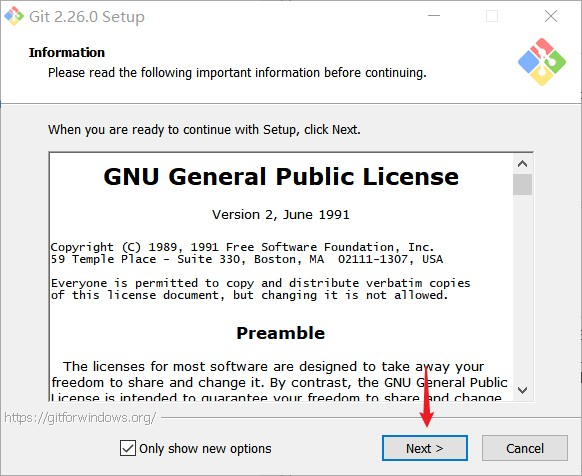
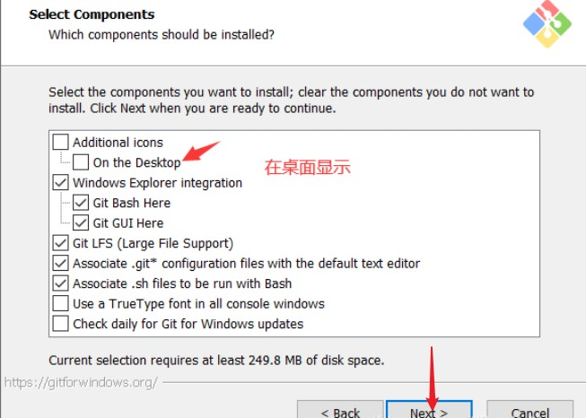
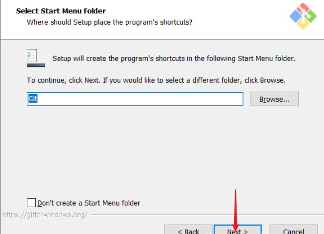
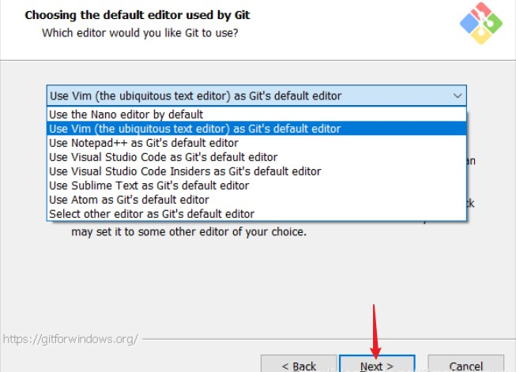
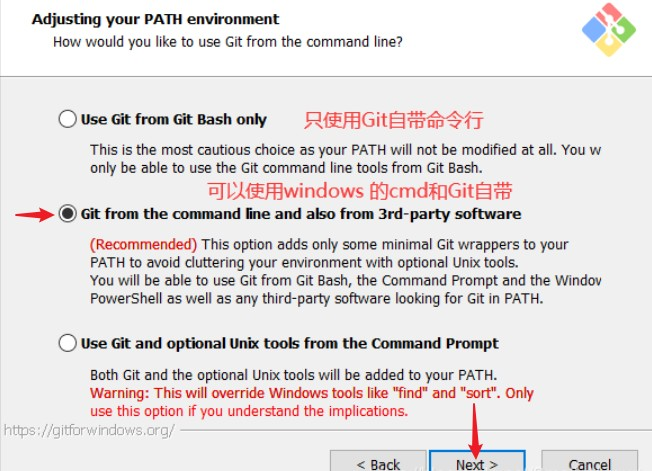
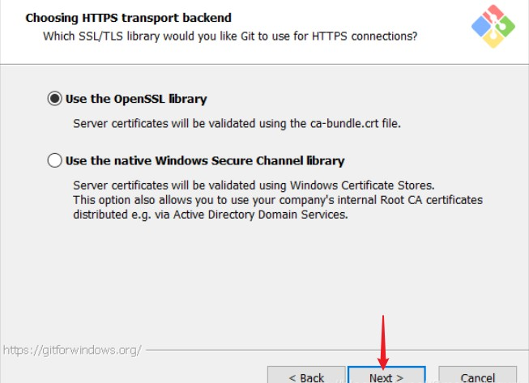
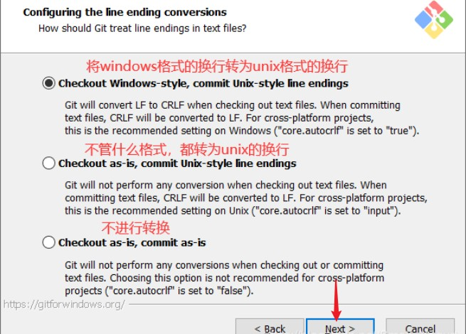
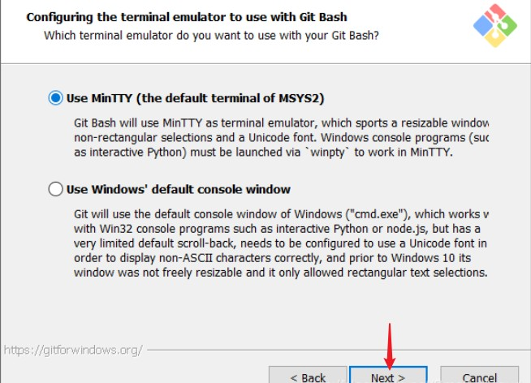
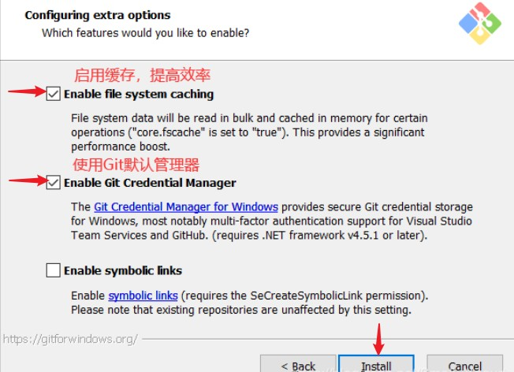
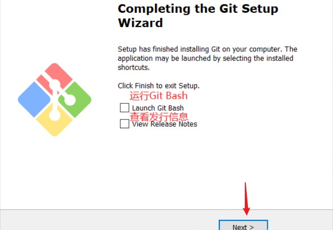

# Git的使用
---

## 实验目的
1. 学习 Git 软件的安装
2. 学习 Git 的简单使用，增加文件，提交，创建分支，增加远程，下拉、上推，合并
3. 学习 Git 的冲突处理 

## 实验平台
- Window 10

## 实验前准备
1. 到[Git](https://github.com/git-for-windows/git/releases/download/v2.26.2.windows.1/Git-2.26.2-64-bit.exe)官网下载 Windows 64-bit版本的git工具。
2. 翻阅相关资料，掌握分布式版本控制系统 Git 的基础知识。
3. 查找 Git 的使用教程，熟悉 Git 命令以及 Git GUI 的使用。

## 实验内容

### GIT的安装

#### 阅读软件许可
  

阅读软件许可并点击 next 进行下一步安装。

#### 选择安装的组件

根据喜好选择：
* 是否添加桌面快捷键图标
* 是否在右键菜单中添加"Git Bash Here"和"Git GUI Here"快速启动
* 将.git*配置文件与默认文本编辑器关联
* 将Bash运行的.sh文件关联

#### 是否创建开始菜单

#### 选择默认编辑方式

这里选择Vim作为默认编辑器。

#### 设置路径环境变量

勾选第二项，将为git命令配置全局环境变量，可以在Windows的cmd模式和Git自带命令行模式使用。

#### 选择HTTP远程连接方式

使用OpenSSL库，而不使用Windows安全通道库，不会产生兼容性问题。

#### 配置换行格式

#### 使用Git默认终端

选择默认的MinTTY终端。

#### 配置额外选项

* 启用缓存，在Git命令行模式可以通过键盘上下键切换出先前使用git命令，提高效率。
* 使用Git为Windows提供的默认管理器。

#### 等待安装

等待安装完后，可以在选择立即运行Git Bash和查看当前发行版的版本说明。

### Git的使用

